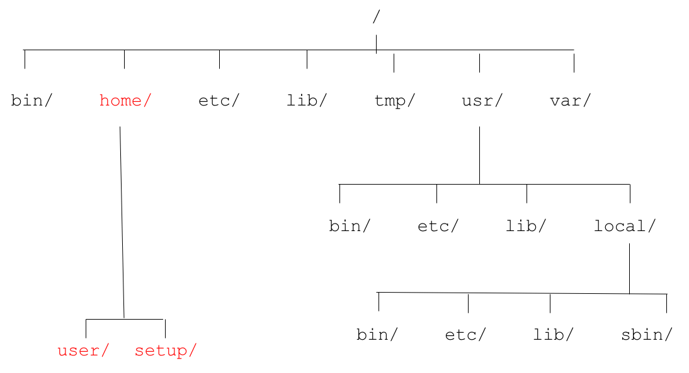
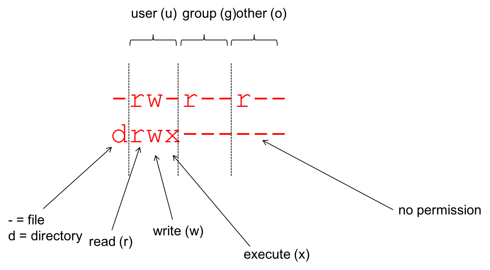

# UNIX_Lecture1_Practical
Katherine Tansey  
8/8/2017  

# Learning Objectives

Understand how to navigate files and directories       
Learn basic Unix commands       
Discover where to get help       
Use a UNIX based text editor      
Understand file permissions           

# Finding the Bash Shell 

## For an Apple OS
Open Applications, then go to the Utilities folder and you should see a program called Terminal. Opening this, opens up a shell. 

## For a Windows OS
You should have downloaded MobaXTerm. Open the MobaXTerm program. 

## If using UNIX/Linux OS
Like Apple OS machines, there will be a program called terminal on your machine. Opening this will open a shell. 

### Practical

Type the following into the bash shell:
```
echo "hello world”
```

> What gets returned?

# Navigating Files and Directories

The set up of a filesystem is dependent on operating system. Each OS will look slightly different.         




Full (absolute) pathnames include entire path from the root directory, meaning any path that starts with **/** is an *absolute path*.       
Relative pathnames are relative to the directory that you are currently in.            

### Practical

Type the following into the bash shell:
```
pwd 
```
> Where are you located on your computer?


## Home Directory
Everyone has their own home directory and the path to your home directory will look different depending on which operating systems you are using.       

tilde (~) is a shortcut for referring to the home directory, but this **only** works if it is the first character in the path.     

$HOME can also be used to represent your home directory location.       

Typing 
```
cd ~
```
Automatically take you to your home directory. 


Typing 
```
cd 
```
without specifying a path or directory will return you to your home directory

### Practical
Type the following into the bash shell:

```
cd ~
```
> Where are you?             
> What is considered your home directory on your computer?             
> Have you moved from the previous practical? If you haven't, why do you think that might have happened?            

# Command line syntax


* **Command** name tells the computer the operation/program/job to perform.
    * ALWAYS a single word
* A command can take **options**
    * Although not always, they are optional 
    * Usually preceded by a dash
    * Change the behaviour of the command: usually the style in which the output is given.
* **Arguments** gives the computer the required input
    * Usually file or directory names
    * Not always required

### Practical
Type the following into the bash shell:

```
ls
```
> What happens?

## Moving around on your computer

*cd* = change directory    
Allows you to change directories and move around your computer. 

..   =  the directory containing this one
.    =  current directory

### Practical
Type the following into the bash shell:
```
cd ../
```
> What happens?        
> Where are you now on your computer? How would you find out (HINT: pwd)?             


Type the following into the bash shell:
```
cd /
```
> Where are you now on your computer?


Type the following into the bash shell:
```
ls
```
> What else is in the root directory?           
> Do you recognize any of these directories? Are there any files?              


Type the following into the bash shell:
```
cd ~
```
> Where are you now on your computer? Are you back in you home directory?        


### Practical
Move to your Documents folder on your computer. This will be slightly different for everyone depending on which operating system you are using. Use cd and pwd to move and check where you are, and use ls to see what each directory contains.       

*We will do this together*

# Getting Help

There are a few built-in unix help options to get information on commands (man, --help, info).

## Using the internet to get help
These are two great resources: [stack exchange](https://unix.stackexchange.com/) and [stack overflow](http://stackoverflow.com/). Usually someone has asked your question before, so search for it. If not, submit your question to the forum to get community support and help. 

### Practical
Type the following into the bash shell:
```
man ls
```

Press ```enter``` or ```spacebar``` to scroll through.                 
> What is the difference between pressing enter or spacebar?            

Press ```q``` to get the input prompt back.


Type the following into the bash shell:
```
ls --help
```
> How does this differ from man?          


Type the following into the bash shell:
```
info ls
```
Press ```enter``` or ```spacebar``` to scroll through.       

Press ```q``` to get the input prompt back.       


# File permissions and privacy
     


Use *chmod* command to change permissions. 


### Practical

Within your Documents folder, let's create a new file.   

Type the following into the bash shell:
```
touch permissions_test.txt
```
> What do you think touch is doing?           

Now type:
```
ls
```
> Do you see the file we just created now listed?         
> What type of permission have been given to the file?                 

Type:
```
ls -l
```
> Where would you go to find out what -l is doing?        
> What do you think the option -l is doing? What has changed about the output from ls?                 

Type:
```
ls -l -t
```
> Where would you go to find out what -t is doing?        
> What has changed about the output from ls?               

Type:
```
ls -lt
```
> Is this any different to the above?              
> What file permission does our newly created file permissions_test.txt have?           
> If you were unsure, where could you go for help?              

Use the up arrow to get the previous command -- alter it to include the *a* option          
> What does this do to the output?          

Let's alter file permissions to give everyone write permissions:          
```
chmod go+w permissions_test.txt
```
> Has that worked? What commands would you run to find out?            

Remove write permission for everyone:
```
chmod 
```
> Check that has worked - what command would you run?          


# Wrapping Up

/ on its own is the root directory of the whole file system            
A relative path specifies a location starting from the current location            
A full (absolute) path specifies a location from the root of the file system            
.. means ‘the directory above the current one’              
. on its own means ‘the current directory’            
Up-arrow to scroll up through previous commands to edit and repeat them           

**There is no trash bin: once something is deleted, it is gone**          

Do not use spaces, quotes, special characters, or wildcard characters such as ‘*’ or ‘?’ in filenames, as it complicates variable expansion.           


